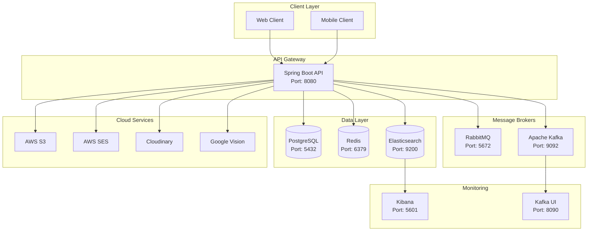

# 📄 UnravelDocs API

[](https://openjdk.org/)
[](https://spring.io/projects/spring-boot)
[](LICENSE)
[](https://maven.apache.org/)

> A comprehensive, enterprise-grade document processing and management platform designed for extracting insights from documents with OCR, AI-powered analysis, secure storage, and multi-provider payment integrations.

---

## 📑 Table of Contents

- [Features](#-features)
- [Architecture](#-architecture)
- [Tech Stack](#-tech-stack)
- [Prerequisites](#-prerequisites)
- [Getting Started](#-getting-started)
- [Configuration](#-configuration)
- [Docker Deployment](#-docker-deployment)
- [API Documentation](#-api-documentation)
- [Testing](#-testing)
- [CI/CD Pipeline](#-cicd-pipeline)
- [Project Structure](#-project-structure)
- [Contributing](#-contributing)
- [License](#-license)

---

## ✨ Features

### Document Processing
- **OCR Processing**: Extract text from images and scanned documents using Tesseract OCR and Google Cloud Vision API
- **PDF Processing**: Extract and analyze content from PDF documents using Apache PDFBox
- **Word Export**: Convert processed documents to Microsoft Word format using Apache POI
- **AI-Powered Analysis** *(Planned)*: Entity extraction, classification, and document summarization

### User Management & Security
- **User Authentication**: JWT-based authentication with access and refresh tokens
- **OAuth 2.0 Integration**: Social login support via Google, GitHub, etc.
- **Role-Based Access Control (RBAC)**: Differentiated access for users and administrators
- **Login Attempt Tracking**: Monitor and limit failed login attempts for security
- **Email Verification**: OTP-based email verification for new accounts
- **Password Reset**: Secure password reset flow with email notifications

### Team Management
- **Team Creation**: OTP-verified team creation for Premium/Enterprise subscribers
- **Subscription Tiers**:
  - **Team Premium**: $29/month or $290/year, 200 docs/month, max 10 members
  - **Team Enterprise**: $79/month or $790/year, unlimited docs, max 15 members
- **10-Day Free Trial**: Automatic trial period with 3-day warning emails
- **Flexible Billing**: Monthly or yearly subscription with auto-renewal
- **Subscription Management**: Cancel anytime but keep access until period ends
- **Member Management**: Add, remove, and batch remove members
- **Role-Based Access**: Owner, Admin, and Member roles with distinct permissions
- **Admin Promotion**: Enterprise-only feature to promote members to admin
- **Email Invitations**: Enterprise-only email invitation system with unique tokens
- **Team Lifecycle**: Close and reactivate teams
- **Privacy Controls**: Email masking for non-owner member views

### Payment Processing
- **Multi-Gateway Support**:
  - **Stripe**: Full integration with webhooks, subscriptions, and one-time payments
  - **Paystack**: Complete African payment gateway integration
  - **PayPal**: International payment support *(stub)*
  - **Flutterwave**: African payment gateway *(stub)*
  - **Chappa**: Ethiopian payment gateway *(stub)*

### Individual Subscription Plans

| Plan | Monthly | Yearly | Docs/Month | OCR Pages |
|------|---------|--------|------------|-----------|
| Free | $0 | - | 5 | 25 |
| Starter | $9 | $90 | 30 | 150 |
| Pro | $19 | $190 | 100 | 500 |
| Business | $49 | $490 | 500 | 2,500 |

> Yearly plans include 17% savings

### Currency Conversion
- **Real-time Exchange Rates**: Prices displayed in user's local currency
- **60+ Supported Currencies**: USD, EUR, GBP, NGN, INR, JPY, AUD, CAD, and more
- **Daily Rate Updates**: Exchange rates refreshed automatically via exchangerate-api.com
- **Fallback Rates**: Cached rates ensure service availability

- **Multi-Currency Support**: Accept payments in multiple currencies
- **Receipt Generation**: Automatic PDF receipt generation with AWS S3 storage

### Search & Analytics
- **Elasticsearch Integration**: Full-text search across documents, users, and payments
- **Kibana Dashboard**: Visual analytics and monitoring

### Communication & Notifications
- **Email Services**: Multi-provider email support (AWS SES, Mailgun)
- **SMS Notifications**: Twilio integration for SMS/voice notifications
- **Push Notifications**: Real-time notification system

### Administration
- **User Management**: View, activate/deactivate users, manage roles
- **Subscription Plan Management**: CRUD operations for subscription plans
- **Document Oversight**: Monitor, view, and moderate documents
- **System Statistics**: Real-time metrics on users, documents, and subscriptions
- **Admin Action Audit Logging**: Track all administrative actions

### Cloud & Storage
- **AWS S3**: Secure document and receipt storage
- **Cloudinary**: Image optimization and CDN delivery
- **CloudFront**: Content delivery network integration

### Internationalization
- **Multi-Language Support**: i18n ready for multiple languages and regional formats

---

## 🏗 Architecture



---

## 🛠 Tech Stack

### Core Framework
| Technology | Version | Purpose |
|------------|---------|---------|
| Java | 25 | Programming Language |
| Spring Boot | 4.0.1 | Application Framework |
| Spring Security | 6.x | Authentication & Authorization |
| Spring Data JPA | 3.x | Data Persistence |
| Spring Data Redis | 3.x | Caching |
| Spring Data Elasticsearch | 3.x | Search Engine |
| Spring AMQP | 3.x | RabbitMQ Messaging |
| Spring Kafka | 3.x | Kafka Messaging |

### Database & Storage
| Technology | Version | Purpose |
|------------|---------|---------|
| PostgreSQL | 17 | Primary Database |
| Redis | 7 (Alpine) | Caching & Session Store |
| Elasticsearch | 8.11.0 | Full-Text Search |
| Flyway | 10.x | Database Migrations |

### Message Brokers
| Technology | Version | Purpose |
|------------|---------|---------|
| RabbitMQ | Latest | Event-Driven Messaging |
| Apache Kafka | 3.7.0 | Stream Processing |

### Cloud Services
| Service | Purpose |
|---------|---------|
| AWS S3 | File Storage |
| AWS SES | Email Delivery |
| AWS SNS | Push Notifications |
| Cloudinary | Image CDN |
| Google Cloud Vision | OCR Processing |

### Document Processing
| Library | Version | Purpose |
|---------|---------|---------|
| Tesseract (Tess4J) | 5.15.0 | OCR Engine |
| Apache PDFBox | 3.0.4 | PDF Processing |
| Apache POI | 5.4.1 | Word Document Export |
| OpenCV | 4.9.0 | Image Processing |
| OpenPDF | 1.3.35 | PDF Generation |

### Payment Gateways
| Provider | SDK Version | Status |
|----------|-------------|--------|
| Stripe | 31.0.0 | ✅ Full |
| Paystack | Custom | ✅ Full |
| PayPal | - | 🔲 Stub |
| Flutterwave | - | 🔲 Stub |
| Chappa | - | 🔲 Stub |

### Security & Authentication
| Technology | Version | Purpose |
|------------|---------|---------|
| JWT (jjwt) | 0.12.6 | Token Authentication |
| OAuth 2.0 | Spring Security | Social Login |
| Bucket4j | 8.1.0 | Rate Limiting |

### Communication
| Service | Purpose |
|---------|---------|
| Mailgun | Email Delivery |
| AWS SES | Email Delivery |
| Twilio | SMS & Voice |

### Development & Utilities
| Tool | Version | Purpose |
|------|---------|---------|
| Lombok | 1.18.42 | Boilerplate Reduction |
| MapStruct | 1.5.5 | Object Mapping |
| SpringDoc OpenAPI | 3.0.0 | API Documentation |
| Logstash Logback | 7.4 | Structured Logging |
| Micrometer | Latest | Metrics & Observability |

### Testing
| Framework | Purpose |
|-----------|---------|
| JUnit 5 | Unit Testing |
| Mockito | Mocking Framework |
| Spring Security Test | Security Testing |
| Kafka Test | Kafka Integration Testing |
| RabbitMQ Test | RabbitMQ Integration Testing |

### Containerization & CI/CD
| Tool | Purpose |
|------|---------|
| Docker | Containerization |
| Docker Compose | Multi-Container Orchestration |
| GitHub Actions | CI/CD Pipeline |

---

## 📋 Prerequisites

- **JDK 25** or higher
- **Apache Maven 3.9.x** or higher
- **Docker** and **Docker Compose** (for containerized deployment)
- **PostgreSQL 17** (if running locally without Docker)
- **Redis 7** (if running locally without Docker)
- **Tesseract OCR** installed locally for OCR processing (optional)
- API keys for desired integrations:
  - Payment gateways (Stripe, Paystack)
  - Email services (Mailgun, AWS SES)
  - Cloud storage (AWS S3, Cloudinary)
  - Google Cloud Vision API

---

## 🚀 Getting Started

### Option 1: Docker Compose (Recommended)

```bash
# 1. Clone the repository
git clone https://github.com/Brints/unraveldocs-api.git
cd unraveldocs-api

# 2. Copy environment template
cp .env.example .env

# 3. Configure your environment variables
# Edit .env with your credentials

# 4. Start all services
docker-compose up -d

# 5. View logs
docker-compose logs -f unraveldocs-api
```

### Option 2: Local Development

```bash
# 1. Clone the repository
git clone https://github.com/Brints/unraveldocs-api.git
cd unraveldocs-api

# 2. Start required services (PostgreSQL, Redis)
docker run --name postgres-unraveldocs -p 5432:5432 \
  -e POSTGRES_USER=postgres \
  -e POSTGRES_PASSWORD=postgres \
  -e POSTGRES_DB=unraveldocs \
  -d postgres:17

docker run --name redis-unraveldocs -p 6379:6379 -d redis:7-alpine

# 3. Configure application properties
# Edit src/main/resources/application.properties or use environment variables

# 4. Build the project
mvn clean install

# 5. Run the application
mvn spring-boot:run

# 6. Access the application
# http://localhost:8080/unraveldocs
```

---

## ⚙️ Configuration

### Environment Variables

Create a `.env` file from the template:

```bash
cp .env.example .env
```

#### Key Configuration Sections

| Section | Description |
|---------|-------------|
| Application | Base URLs, support email, frontend URL |
| Database | PostgreSQL connection details |
| Redis | Cache configuration |
| RabbitMQ | Message broker settings |
| Kafka | Stream processing configuration |
| AWS | S3, SES, SNS credentials |
| JWT | Token secrets and expiration |
| Mailgun | Email service credentials |
| Cloudinary | Image CDN configuration |
| Twilio | SMS/Voice settings |
| Stripe | Payment gateway credentials |
| Paystack | African payment gateway |
| Google Cloud | Vision API credentials |
| Elasticsearch | Search engine configuration |

### Application Properties

```properties
# Server Configuration
server.port=8080
server.servlet.context-path=/unraveldocs

# Database Configuration
spring.datasource.url=jdbc:postgresql://localhost:5432/unraveldocs
spring.datasource.username=postgres
spring.datasource.password=postgres
spring.jpa.hibernate.ddl-auto=validate

# JWT Configuration
jwt.secret=your-very-strong-jwt-secret-key
jwt.expiration.ms=86400000

# Flyway Migration
spring.flyway.enabled=true
spring.flyway.locations=classpath:db/migration
```

---

## 🐳 Docker Deployment

### Services Overview

| Service | Port(s) | Description |
|---------|---------|-------------|
| unraveldocs-api | 8080 | Main application |
| postgres | 5432 | Primary database |
| redis | 6379 | Cache & sessions |
| rabbitmq | 5672, 15672 | Message broker |
| kafka | 9092 | Stream processing |
| kafka-ui | 8090 | Kafka dashboard |
| elasticsearch | 9200, 9300 | Search engine |
| kibana | 5601 | ES dashboard |
| localstack | 4566 | AWS local emulation |

### Docker Commands

```bash
# Start all services
docker-compose up -d

# Start specific services
docker-compose up -d postgres redis

# Stop all services
docker-compose down

# View logs
docker-compose logs -f [service-name]

# Rebuild application
docker-compose build unraveldocs-api
docker-compose up -d unraveldocs-api

# Remove volumes (clean slate)
docker-compose down -v
```

---

## 📚 API Documentation

### Swagger UI
Once the application is running, access the interactive API documentation:
- **Swagger UI**: http://localhost:8080/unraveldocs/swagger-ui.html
- **OpenAPI Spec**: http://localhost:8080/unraveldocs/v3/api-docs

### API Endpoints Overview

| Category | Base Path | Description |
|----------|-----------|-------------|
| Auth | `/api/v1/auth` | Authentication & registration |
| Users | `/api/v1/users` | User management |
| Teams | `/api/v1/teams` | Team subscriptions & member management |
| Organizations | `/api/v1/organizations` | Enterprise organization management |
| Documents | `/api/v1/documents` | Document operations |
| OCR | `/api/v1/ocr` | OCR processing |
| Payments | `/api/v1/payments` | Payment operations |
| Stripe | `/api/v1/stripe` | Stripe-specific endpoints |
| Paystack | `/api/v1/paystack` | Paystack-specific endpoints |
| Subscriptions | `/api/v1/subscriptions` | Individual subscription management |
| Admin | `/api/v1/admin` | Administrative operations |
| Search | `/api/v1/search` | Elasticsearch queries |

---

## 🧪 Testing

### Run All Tests
```bash
mvn test
```

### Run Specific Test Class
```bash
mvn test -Dtest=DocumentServiceTest
```

### Run Specific Test Method
```bash
mvn test -Dtest=FileProcessingServiceTest#testProcessSingleFile
```

### Generate Coverage Report
```bash
mvn clean test jacoco:report
```
Coverage report will be available at `target/site/jacoco/index.html`

### Integration Tests
```bash
mvn verify -P integration-tests
```

---

## 🔄 CI/CD Pipeline

The project uses **GitHub Actions** for continuous integration and deployment:

### Workflows

| Workflow | Trigger | Purpose |
|----------|---------|---------|
| `test.yml` | Push/PR to main | Run tests & build |
| `linting.yml` | Push/PR | Code style checks |
| `security.yml` | Push/PR | Security scanning |
| `deploy.yml` | Push to main | Deploy to staging/prod |
| `release.yml` | Tag creation | Create releases |
| `flyway.yml` | Manual | Database migrations |

### Pipeline Features
- Automated testing on every push
- Code quality checks (Checkstyle, SpotBugs)
- Security vulnerability scanning
- JaCoCo test coverage reporting
- Docker image building and pushing
- Automated deployments

---

## 📁 Project Structure

```
unraveldocs-api/
├── .github/
│   ├── workflows/          # CI/CD pipeline definitions
│   └── scripts/            # Automation scripts
├── src/
│   ├── main/
│   │   ├── java/com/extractor/unraveldocs/
│   │   │   ├── admin/            # Admin management
│   │   │   ├── auth/             # Authentication & authorization
│   │   │   ├── brokers/          # Message broker integrations
│   │   │   ├── config/           # Application configurations
│   │   │   ├── documents/        # Document management
│   │   │   ├── elasticsearch/    # Search functionality
│   │   │   ├── exceptions/       # Custom exceptions & handlers
│   │   │   ├── googlevision/     # Google Cloud Vision integration
│   │   │   ├── loginattempts/    # Login attempt tracking
│   │   │   ├── messaging/        # Email & notification services
│   │   │   ├── ocrprocessing/    # OCR processing services
│   │   │   ├── organization/     # Enterprise organization management
│   │   │   │   ├── controller/   # REST endpoints
│   │   │   │   ├── dto/          # Request/response DTOs
│   │   │   │   ├── impl/         # Service implementations
│   │   │   │   ├── model/        # Entity models
│   │   │   │   └── repository/   # Data repositories
│   │   │   ├── team/             # Team subscription management
│   │   │   │   ├── controller/   # Team REST endpoints
│   │   │   │   ├── dto/          # Team request/response DTOs
│   │   │   │   ├── impl/         # Team service implementations
│   │   │   │   ├── model/        # Team entity models
│   │   │   │   ├── repository/   # Team data repositories
│   │   │   │   └── service/      # Team service interfaces
│   │   │   ├── payment/          # Payment gateway integrations
│   │   │   │   ├── common/       # Shared payment utilities
│   │   │   │   ├── stripe/       # Stripe integration
│   │   │   │   ├── paystack/     # Paystack integration
│   │   │   │   ├── paypal/       # PayPal stub
│   │   │   │   ├── flutterwave/  # Flutterwave stub
│   │   │   │   ├── chappa/       # Chappa stub
│   │   │   │   └── receipt/      # Receipt generation
│   │   │   ├── pushnotification/ # Push notification services
│   │   │   ├── security/         # Security configurations
│   │   │   ├── shared/           # Shared utilities & DTOs
│   │   │   ├── subscription/     # Subscription management
│   │   │   ├── user/             # User management
│   │   │   ├── utils/            # Common utilities
│   │   │   └── wordexport/       # Word document export
│   │   └── resources/
│   │       ├── db/migration/     # Flyway migrations
│   │       ├── templates/        # Email templates (Thymeleaf)
│   │       └── application.properties
│   └── test/                     # Test sources
├── docker-compose.yml            # Multi-container setup
├── Dockerfile                    # Application container
├── pom.xml                       # Maven dependencies
├── .env.example                  # Environment template
└── README.md
```

---

## 🤝 Contributing

1. Fork the repository
2. Create a feature branch (`git checkout -b feature/amazing-feature`)
3. Commit your changes (`git commit -m 'Add amazing feature'`)
4. Push to the branch (`git push origin feature/amazing-feature`)
5. Open a Pull Request

### Code Style
- Follow Java coding conventions
- Use meaningful variable and method names
- Write comprehensive unit tests
- Document public APIs with Javadoc

---

## 📄 License

This project is licensed under the MIT License - see the [LICENSE](LICENSE) file for details.

---

## 📞 Support

- **Email**: support@unraveldocs.xyz
- **Issues**: [GitHub Issues](https://github.com/Brints/unraveldocs-api/issues)

---

<p align="center">Made with ❤️ by the UnravelDocs Team</p>