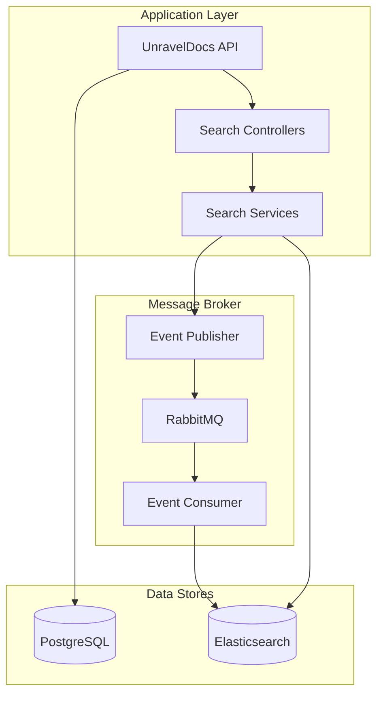

# Elasticsearch Integration

This document summarizes the Elasticsearch integration implemented in UnravelDocs, providing full-text search capabilities for documents, users, and payments.

## Architecture Overview



---

## Files Created

### Configuration

| File | Description |
|------|-------------|
| `ElasticsearchConfig.java` | Elasticsearch client configuration |
| `document-settings.json` | Index settings for document search |

### Events

| File | Description |
|------|-------------|
| `IndexAction.java` | Enum: CREATE, UPDATE, DELETE |
| `IndexType.java` | Enum: DOCUMENT, USER, PAYMENT, SUBSCRIPTION |
| `ElasticsearchIndexEvent.java` | Event class for RabbitMQ messages |

### Document Indexes (Elasticsearch Mappings)

| File | Description |
|------|-------------|
| `DocumentSearchIndex.java` | Index for documents and OCR content |
| `UserSearchIndex.java` | Index for user search |
| `PaymentSearchIndex.java` | Index for payment/receipt search |

### Repositories

| File | Description |
|------|-------------|
| `DocumentSearchRepository.java` | Document search repository with custom queries |
| `UserSearchRepository.java` | User search repository with filters |
| `PaymentSearchRepository.java` | Payment search repository with date ranges |

### Services

| File | Description |
|------|-------------|
| `DocumentSearchService.java` | Full-text document search |
| `UserSearchService.java` | Admin user search |
| `PaymentSearchService.java` | Payment/receipt search |
| `ElasticsearchSyncService.java` | Bulk data synchronization |

### Event Publisher & Consumer

| File | Description |
|------|-------------|
| `ElasticsearchEventPublisher.java` | Publishes index events to RabbitMQ |
| `ElasticsearchIndexConsumer.java` | Processes events and updates Elasticsearch |

### DTOs

| File | Description |
|------|-------------|
| `SearchRequest.java` | Generic search request with filters |
| `SearchResponse.java` | Generic search response with pagination |
| `DocumentSearchResult.java` | Document-specific result with highlights |

### Controllers

| File | Description |
|------|-------------|
| `DocumentSearchController.java` | User document search endpoints |
| `AdminSearchController.java` | Admin user/payment search endpoints |
| `ElasticsearchSyncController.java` | Sync management endpoints |

---

## Modified Files

| File | Changes |
|------|---------|
| `docker-compose.yml` | Added Elasticsearch and Kibana services |
| `.env.example` | Added Elasticsearch environment variables |
| `RabbitMQQueueConfig.java` | Added Elasticsearch exchange, queues, and bindings |
| `EventTypes.java` | Added Elasticsearch event type constants |

---

## API Endpoints

### Document Search (User Access)

| Method | Endpoint | Description |
|--------|----------|-------------|
| `POST` | `/api/v1/search/documents` | Search documents with full request body |
| `GET` | `/api/v1/search/documents` | Quick search with query params |
| `GET` | `/api/v1/search/documents/content` | Search within OCR text |

### Admin Search (Admin Only)

| Method | Endpoint | Description |
|--------|----------|-------------|
| `POST` | `/api/v1/admin/search/users` | Search users with filters |
| `GET` | `/api/v1/admin/search/users` | Quick user search |
| `POST` | `/api/v1/admin/search/payments` | Search payments with filters |
| `GET` | `/api/v1/admin/search/payments` | Quick payment search |
| `GET` | `/api/v1/admin/search/payments/receipt/{number}` | Lookup by receipt number |

### Sync Management (Admin Only)

| Method | Endpoint | Description |
|--------|----------|-------------|
| `POST` | `/api/v1/admin/elasticsearch/sync` | Full data sync (async) |
| `POST` | `/api/v1/admin/elasticsearch/sync/users` | Sync users only |
| `POST` | `/api/v1/admin/elasticsearch/sync/documents` | Sync documents only |
| `POST` | `/api/v1/admin/elasticsearch/sync/payments` | Sync payments only |

---

## Usage Instructions

### 1. Start Elasticsearch and Kibana

```bash
docker-compose up -d elasticsearch kibana
```

### 2. Update your .env file

```properties
ELASTICSEARCH_HOST=elasticsearch  # or localhost for local dev
ELASTICSEARCH_PORT=9200
SPRING_ELASTICSEARCH_URIS=http://elasticsearch:9200
```

### 3. Initial Data Sync

After starting the application, sync existing data:

```bash
curl -X POST http://localhost:8080/api/v1/admin/elasticsearch/sync \
  -H "Authorization: Bearer <admin_token>"
```

### 4. Search Documents

```bash
# Full-text search
curl -X POST http://localhost:8080/api/v1/search/documents \
  -H "Authorization: Bearer <token>" \
  -H "Content-Type: application/json" \
  -d '{
    "query": "invoice",
    "page": 0,
    "size": 10
  }'
```

### 5. Access Kibana

Open http://localhost:5601 to explore indexes and run Dev Tools queries.

---

## Next Steps (Optional Enhancements)

1. **Integration with existing services**: Add calls to `ElasticsearchSyncService.indexUser()` in `SignupUserImpl` after user creation
2. **OCR integration**: Call `ElasticsearchSyncService.indexDocument()` in OCR processing flow  
3. **Payment integration**: Index receipts when they are generated
4. **Add more search features**: Autocomplete, suggestions, faceted search
5. **Implement audit log indexing** when audit log entities are created
