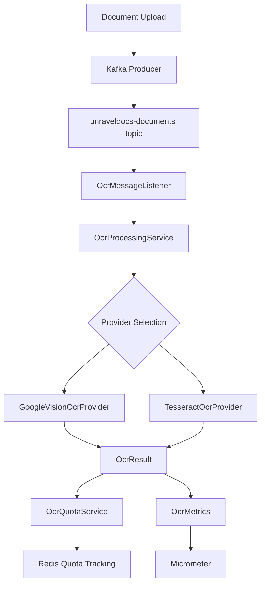

# Google Cloud Vision API Integration

This document summarizes the implementation of Google Cloud Vision API integration for OCR processing in the UnravelDocs application.

---

## Overview

The implementation provides a unified OCR provider abstraction layer that supports both **Tesseract** (local) and **Google Cloud Vision** (cloud) for text extraction. The system uses **Kafka** for asynchronous processing, includes **tier-based quota management**, and provides **automatic fallback** between providers.

## Architecture



---

## Files Created/Modified

### Core Abstraction Layer

| File | Description |
|------|-------------|
| `OcrProvider.java` | Core interface for OCR providers |
| `OcrProviderType.java` | Enum for provider types (TESSERACT, GOOGLE_VISION) |
| `OcrRequest.java` | Standardized OCR request DTO |
| `OcrResult.java` | Standardized OCR result DTO |
| `OcrProviderFactory.java` | Factory for provider selection and fallback |

### Google Cloud Vision Implementation

| File | Description |
|------|-------------|
| `GoogleVisionOcrProvider.java` | Vision API provider implementation |
| `GoogleVisionConfig.java` | Spring configuration for Vision client |
| `GoogleVisionProperties.java` | Configuration properties |
| `GoogleVisionHealthIndicator.java` | Health check for Vision API |

### Tesseract Provider

| File | Description |
|------|-------------|
| `TesseractOcrProvider.java` | Tesseract provider implementation |

### Service Layer

| File | Description |
|------|-------------|
| `OcrProcessingService.java` | High-level orchestration service |
| `ProcessOcr.java` | Updated to use new abstraction |
| `OcrProperties.java` | OCR configuration properties |

### Metrics & Quota

| File | Description |
|------|-------------|
| `OcrMetrics.java` | Micrometer metrics for OCR |
| `OcrQuotaService.java` | Redis-backed quota management |

### Kafka Events

| File | Description |
|------|-------------|
| `VisionOcrRequestedEvent.java` | Kafka event for Vision OCR requests |
| `VisionOcrEventPublisher.java` | Kafka event publisher |

---

## Configuration

### Environment Variables (.env)

```properties
# OCR Provider Selection
OCR_DEFAULT_PROVIDER=tesseract
OCR_FALLBACK_ENABLED=true
OCR_FALLBACK_PROVIDER=tesseract
OCR_ENABLED_PROVIDERS=TESSERACT,GOOGLE_VISION

# Quota Settings
OCR_QUOTA_ENABLED=true
OCR_QUOTA_FREE_TIER_DAILY_LIMIT=50
OCR_QUOTA_BASIC_TIER_DAILY_LIMIT=200
OCR_QUOTA_PREMIUM_TIER_DAILY_LIMIT=1000
OCR_QUOTA_ENTERPRISE_TIER_DAILY_LIMIT=-1

# Google Cloud Vision
OCR_GOOGLE_VISION_ENABLED=false
OCR_GOOGLE_VISION_TIMEOUT_SECONDS=30
OCR_GOOGLE_VISION_INCLUDE_CONFIDENCE=true
```

### To Enable Google Cloud Vision

1. Set `ocr.google-vision.enabled=true`
2. Add `GOOGLE_VISION` to `ocr.enabled-providers`
3. Configure Google Cloud credentials via `GOOGLE_APPLICATION_CREDENTIALS` environment variable
4. Optionally set `ocr.default-provider=google-vision`

---

## Key Features

### Provider Abstraction
- Unified `OcrProvider` interface for all OCR implementations
- Standardized `OcrRequest` and `OcrResult` DTOs
- Factory pattern for provider selection

### Fallback Mechanism
- Automatic fallback when primary provider fails
- Configurable via `ocr.fallback-enabled` and `ocr.fallback-provider`
- Metrics tracking for fallback events

### Quota Management
- Tier-based daily limits (free, basic, premium, enterprise)
- Redis-backed distributed quota tracking
- Automatic daily reset

### Metrics & Monitoring
- Request counts, success/error rates
- Processing duration histograms
- Confidence score distributions
- Quota usage tracking
